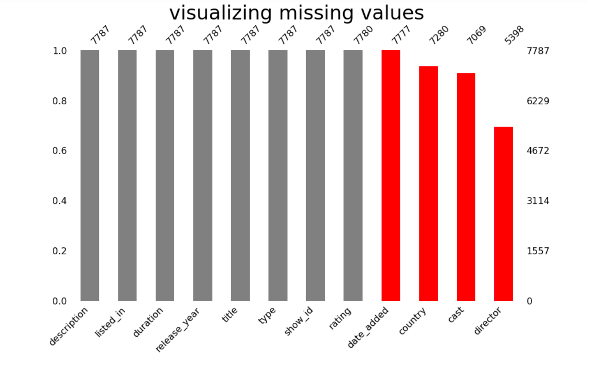
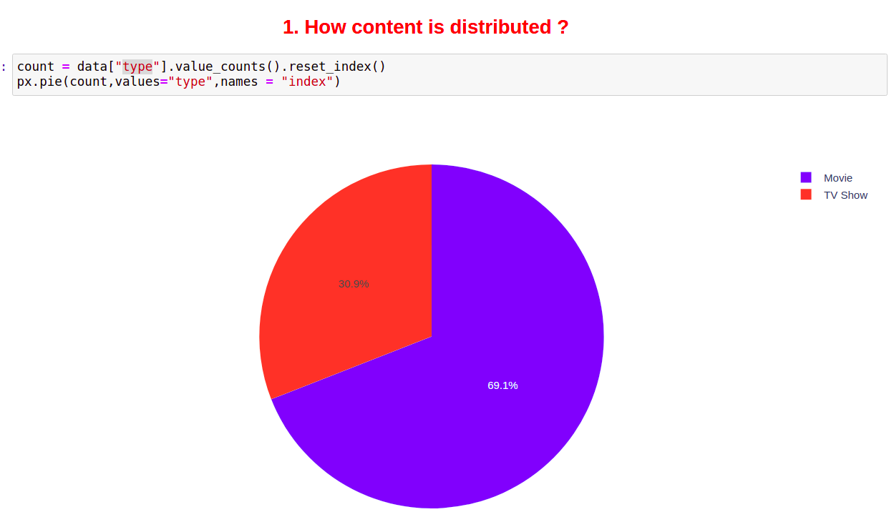
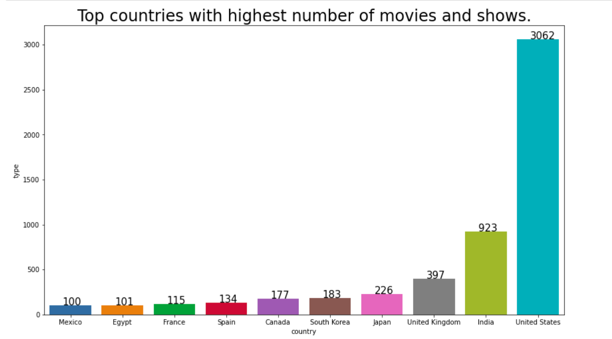
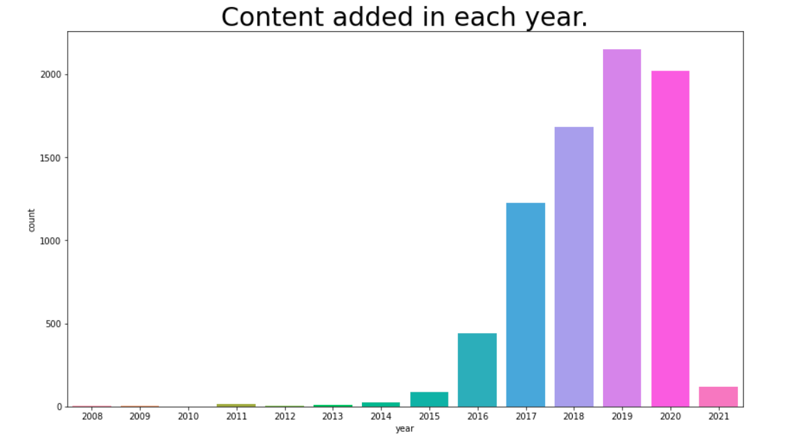
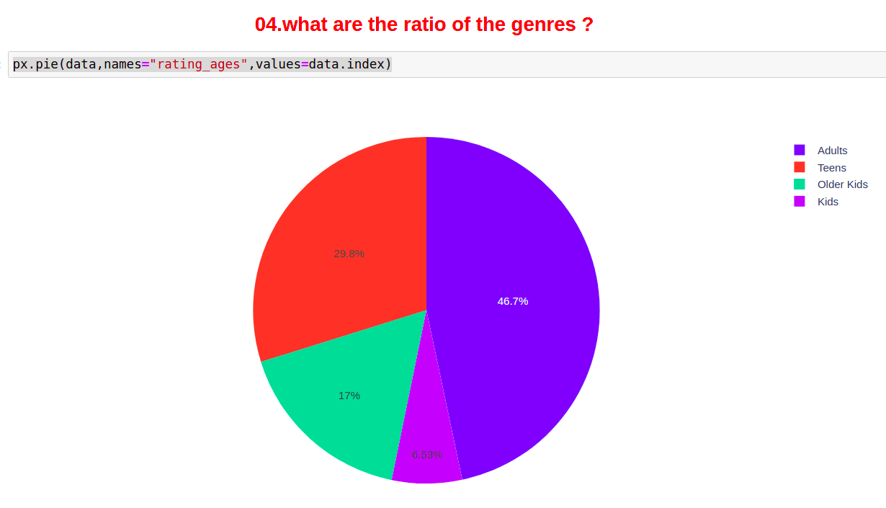

# EDA on Netflix Movies and TV Shows dataset

Who doesn’t like Netflix? This dataset on kaggle has tv shows and movies available on Netflix. One can create a good quality Exploratory Data Analysis project using this dataset. Using this dataset, one can find out: what type of content is produced in which country, identify similar content from the description, and much more interesting tasks.  
So in this project I am doing exploratory data analysis (data cleaning , data proceccing , data visualizations) on this dataset.

# Contents
0. **ABOUT THE DATA**

1. **IMPORTING LIBRARIES**

2. **DATA DESCRIPTION AND DATA CLEANING**

    1. Import data

    2. Data types

    3. Missing values  

    

    4. Duplicates

3. **DATA ANALYSIS AND CONCLUSIONS**

    1. How content is distributed ?  

    

    2. WHAT ARE THE COUNTRIES WITH HIGHEST NUMBER OF MOVIES & TV-SHOWS ?  

    

    3. what is the content added in each year ?  

    

    4. what are the ratio of the genres ?  

    

4. **RECOMMENDATION SYSTEM**

# About the data

### FEATURES:

1. SHOW-ID - Unique id of each show (not much of a use for us in this project)
2. TYPE - The category of a show, can be either a Movie or a TV Show
3. TITLE - Name of the show
4. DIRECTOR - Name of the director(s) of the show
5. CAST - Name of the show
6. COUNTRY - Name of countries the show is available to watch on Netflix
7. DATE ADDED - Date when the show was added on Netflix
8. RATING - Show rating on netflix
9. RELEASE YEAR - Release year of the show
10. DURATION - Time duration of the show
11. LISTED IN - Genre of the show
